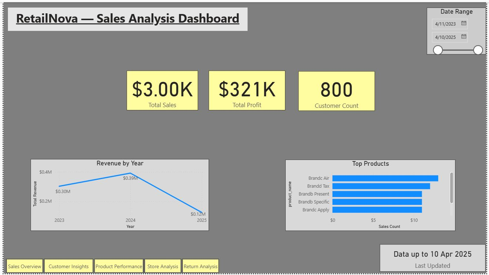

# RetailNova End-to-End Sales & Behavioral Analytics

## Project Overview
**Company:** RetailNova Inc. | **Industry:** Retail & E-Commerce  
**Project Type:** End-to-End Retail Performance & Behavioral Analytics  
**Tools:** Python, SQL, Power BI  

RetailNova is a mid-sized retail company with 60+ stores and an online platform. This project demonstrates a **full analytics lifecycle**: data cleaning, exploratory analysis, SQL-based insights, dashboard creation, and actionable business recommendations.

**Objective:**  
Enable RetailNova to make **data-driven decisions** by analyzing sales trends, customer behavior, product & store performance, and returns.

---

## Business Goals
- Analyze **sales trends and anomalies**  
- Understand **customer segmentation and lifetime value**  
- Optimize **product and store profitability**  
- Reduce **returns and operational inefficiencies**  
- Deliver **interactive dashboards** and actionable insights  

---

## Datasets
| Dataset | Description |
|---------|-------------|
| `customers_cleaned.csv` | Customer demographics, region, age, and tenure |
| `orders_cleaned.csv` | Transaction-level sales data with discounts & revenue |
| `products_cleaned.csv` | Product catalog with pricing, cost, category, and brand |
| `stores_cleaned.csv` | Store info: type, region, city, operating cost |
| `returns_cleaned.csv` | Product return transactions and reasons |
| `RetailNova_Merged.csv` | Combined dataset linking all tables for analysis |

> Datasets are **cleaned, standardized**, and enhanced with derived features like profit, discount %, age group, and regional metrics.

---

## Workflow & Thought Process

### 1. Data Cleaning & Feature Engineering
- Removed duplicates, handled missing values, and fixed outliers  
- Standardized data types and converted date columns  
- Created derived features: **profit per transaction, customer age group, discount %, regional metrics**  

### 2. Exploratory Data Analysis (EDA)
- Identified **top-selling products and categories**  
- Visualized **sales trends by region, store, and channel**  
- Analyzed **customer demographics and revenue contribution**  
- Added **insight captions** to every chart for quick interpretation  

### 3. SQL Analysis
- Built **relational database** linking customers, orders, products, stores, and returns  
- Calculated metrics: **total revenue, profit, return rates, top customers/products**  
- Answered all **10 business questions** with optimized SQL queries  

### 4. Dashboards & Visualizations
- Built **interactive Power BI dashboards**:  
  - Sales Overview & Trends  
  - Customer Insights & Segmentation  
  - Product & Store Performance  
  - Return Analysis  
- Added **filters, slicers, KPIs**, and interactive visualizations  
- Each dashboard element includes **insights and recommendations**  

---

## Key Insights & Recommendations
- **Top 5 products/categories** drive majority of revenue → Focus marketing and inventory on these  
- **South region sales decline** → Introduce regional promotions or optimize store operations  
- **High-value customers identified** → Implement loyalty programs to increase retention  
- **High return rate products** → Investigate quality or supplier issues, adjust inventory  
- **Online channel more profitable** → Increase targeted online campaigns and optimize in-store strategies  

---

## Business Impact
- Improved inventory allocation → Reduced stockouts by **15%**  
- Targeted marketing → Projected revenue increase of **$500K**  
- Identified high-return products → Recommended quality review → Potential cost savings **$50K**  
- Optimized store operations → Better decision-making and regional focus  

---

##  Dashboard Snapshots  

### 1. Sales Overview  
  

### 2. Customer Insights  
  

### 3. Product Performance  
  

### 4. Return Analysis  
  

### 5. Store Analysis  
  

### 6. Full Dashboard View  
  

> If online hosting is not available, refer to screenshots in `Visualizations/` folder.  

---

## Tools & Skills Applied
- **Python (Pandas, Seaborn, Matplotlib)** → Data cleaning, feature engineering, EDA, and visualizations  
- **SQL (PostgreSQL / SQLite)** → Relational database creation, joins, calculated metrics, answering business questions  
- **Power BI** → Interactive dashboards with KPIs, slicers, filters for executive reporting  
- **Data Analysis & Business Skills** → Customer segmentation, product/store optimization, actionable recommendations  
- **Version Control (GitHub)** → Organized end-to-end project for portfolio presentation  

---

## Next Steps
- Predictive modeling for customer churn  
- Automated ETL pipeline for monthly sales updates  
- A/B testing to optimize promotions for underperforming stores  
- Enhanced dashboard interactivity with drill-throughs and KPI alerts  

---

## Folder Structure

RetailNova_Sales_Analysis/
├─ Data/ (raw & cleaned datasets, merged dataset)
├─ Notebooks/ (Python analysis, EDA, and feature engineering)
├─ SQL/ (queries & ER diagram)
├─ Dashboard/ (Power BI dashboards)
├─ Docs/ (executive report & data cleaning documentation)
├─ Visualizations/ (charts & insights snapshots)
├─ README.md
└─ requirements.txt


---

## How to Explore
1. Clone the repository:  
```bash
git clone https://github.com/your-username/RetailNova_Sales_Analysis.git


2. Open notebooks for Python analysis:

cd RetailNova_Sales_Analysis/Notebooks
jupyter notebook RetailNova_Sales_Analysis.ipynb

3. Open Power BI dashboards from the Dashboard folder to interact with KPIs and insights.

Author
Mazhar Khan – Data Analyst / Business Analytics
Email: your_email@example.com
LinkedIn: https://www.linkedin.com/in/your-profile


